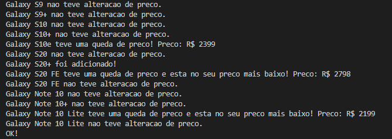
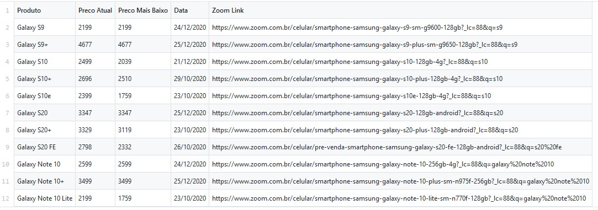

# ZoomTracker

Um programa feito em Python para facilitar a visualização de preços de múltiplos produtos do site Zoom!

## Como funciona:

Nessa versão você precisa adiconar apenas o nome do produto e o link dele do Zoom no arquivo 'planilha.csv'. O programa irá adicionar o preço atual dos produtos 
na planilha. 

## Exemplo:

## Futuros updates:
Pretendo implementar a adição do preço mais baixo também, mas ainda preciso aprender a usar o Selenium. Por enquanto, caso não seja adicionado manualmente,
o valor mais baixo será o valor do produto na primeira vez que o programa rodar. Nas futuras iterações do programa ele irá conferir o preço do produto atualmente com o 
preço mais baixo normalmente.

